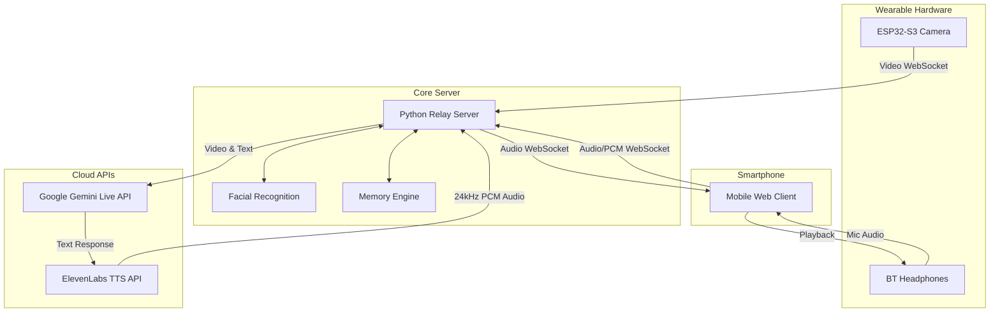

<div align="center">
  
  
  <p align="center">
    <b>A real-time, wearable vision and voice assistant powered by ESP32, Gemini Live, and ElevenLabs.</b>
  </p>

  [](https://opensource.org/licenses/MIT)
  [](https://www.python.org/downloads/)
  [](https://www.espressif.com/en/products/socs/esp32)
  [](https://deepmind.google/technologies/gemini/)
  [](https://elevenlabs.io/)
</div>

---

## 🌟 Overview

**Vision Assist** transforms standard hardware into an advanced AI companion. By combining the **Seeed Studio XIAO ESP32S3 Sense** camera with your smartphone's Bluetooth audio, it creates a fully immersive "smart glasses" experience without the premium price tag.

The system streams live video to Google's powerful **Gemini 2.5 Flash** multimodal model, which acts as the visual cortex, while utilizing **ElevenLabs** for ultra-realistic, ultra-low latency voice responses directly to your headphones.

### 🚀 Key Features

- **👀 Live Video Processing:** Real-time visual context using the ESP32 camera.
- **🗣️ Hyper-Realistic Voice:** Integrated ElevenLabs TTS for natural, human-like AI speech.
- **🧠 Advanced Memory:** Built-in facial recognition and long-term memory engine to remember names, preferences, and context.
- **🎧 Zero-Friction Audio:** Uses your existing smartphone and Bluetooth headphones—no extra audio hardware required!
- **🌐 Cloud-Ready:** Can be run locally or deployed to Railway/Fly.io.

---

## 🏗️ Architecture



---

## 🛠️ Getting Started

### 1. Hardware Requirements
- **Seeed Studio XIAO ESP32S3 Sense** (with camera expansion board)
- **USB-C Cable** (for power & programming)
- **Smartphone** (for mobile hotspot and mic/speaker interface)
- **Bluetooth Headphones** (AirPods, Galaxy Buds, etc.)

### 2. Server Setup

1. **Install Dependencies**
   ```bash
   cd server
   pip install -r requirements.txt
   ```

2. **Configure Environment**
   ```bash
   cp .env.example .env
   ```
   Add your API keys to `.env`:
   ```env
   GEMINI_API_KEY=your_gemini_key_here
   ELEVENLABS_API_KEY=your_elevenlabs_key_here
   ELEVENLABS_VOICE_ID=21m00Tcm4TlvDq8ikWAM  # Default: Rachel
   ```

3. **Launch the Core Server**
   ```bash
   python server.py
   ```
   *The server will output a dashboard URL, a phone interface URL, and the server IP.*

### 3. Firmware Setup

1. Open `esp32_firmware/esp32_firmware.ino` in the Arduino IDE.
2. Edit `esp32_firmware/config.h`:
   ```cpp
   #define WIFI_SSID "Your_Phone_Hotspot"
   #define WIFI_PASSWORD "Hotspot_Password"
   #define SERVER_HOST "YOUR_SERVER_IP"
   ```
3. Install the **WebSockets** library by Markus Sattler.
4. Flash the firmware to your XIAO ESP32S3.

---

## 📱 Daily Usage

1. **Connect** your Bluetooth headphones to your smartphone.
2. **Turn on** your phone's Wi-Fi hotspot (ensure ESP32 and Server are connected to it).
3. **Power** the ESP32 (blue LED indicates successful connection).
4. **Open** `http://<SERVER_IP>:8080/phone` in your phone's browser.
5. **Tap** the mic button to start your ambient AI session!

> 💡 **Pro Tip:** You can lock your phone screen. The ambient session utilizes a wake lock and will continue to run seamlessly in the background.

---

## 📄 License

This project is licensed under the MIT License - see the [LICENSE](LICENSE) file for details.

<div align="center">
  <i>"Giving AI a window to your world."</i>
</div>
